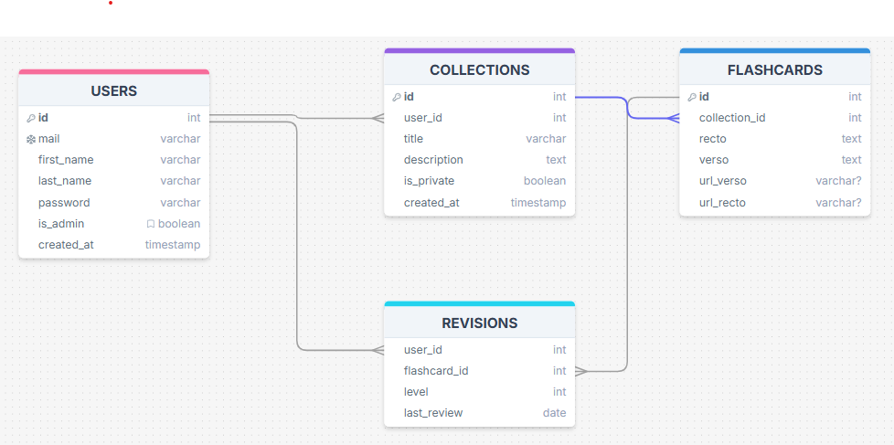

# flashcards_API

Guide rapide d'installation et d'utilisation.

## Prérequis
- Git
- Node.js (version recommandée dans le projet)
- SQLite (fichier .db local utilisé par défaut)

## Installation
1. Cloner le dépôt :
   ```
   git clone https://github.com/TarekRemo/flashcards_API.git
   ```
2. Installer les dépendances :
   ```
   npm install
   ```

## Configuration des variables d'environnement
1. Créer un fichier `.env` à la racine du projet.
2. Copier le contenu de `.env.exemple` dans `.env` et adapter les valeurs.
3. Créer le fichier de base de données `.db` (le nom doit correspondre à celui défini dans `.env`).

## Initialisation de la base de données
- Créer le schéma :
  ```
  npm run db:push
  ```
- (Optionnel) Insérer des données de test :
  ```
  npm run db:seed
  ```
- (Optionnel) Lancer l'interface Drizzle (Studio) :
  ```
  npm run db:studio
  ```



## Lancer le serveur
Démarrer l'API :
```
node src/server.js
```
Le serveur démarre et les routes sont disponibles pour les requêtes.